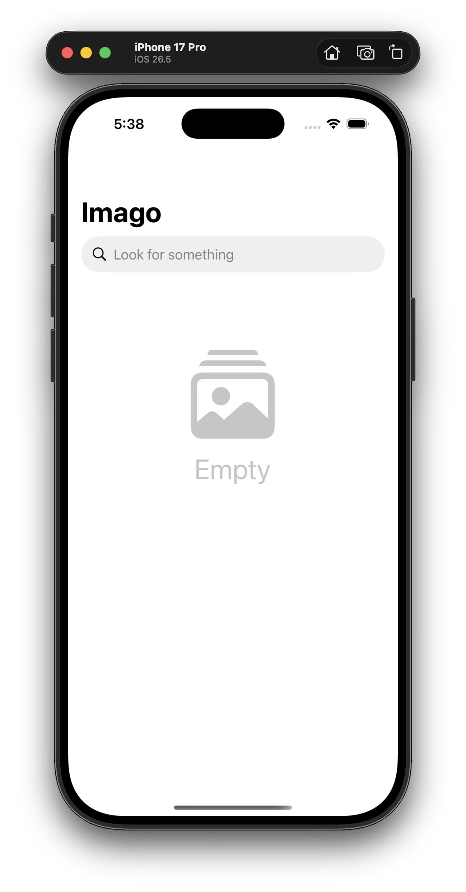
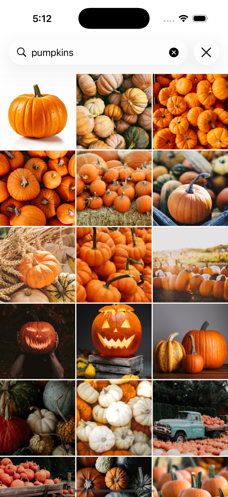
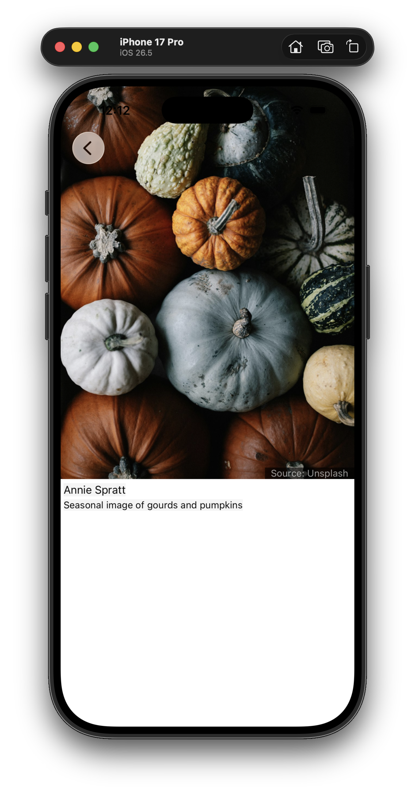

  

# Imago
Image is an iOS sample application for interacting with the Unsplash API.

*'Imago' (Latin for 'image')*.

  
  
  

## Goals
1. Build an iOS application that queries the Unsplash API using a search term.
2. Architect the code to support display of sample data for immediate build and run.
3. Incorporate a variety of technologies as development proceeds.

## Usage

This application is intended for demonstration purposes only and not to be deployed on the App Store.

*Demonstration*
1. Check out this project from GitHub.
2. Edit Scheme > Imago > Edit Scheme... > Check --sampleData
3. Build and run.
4. Search only works with live daata.

*Live Data*
1. Create an Unsplash developer account at [Unsplash](https://unsplash.com/documentation#creating-a-developer-account).
2. Create a new app under this account.
3. In the Xcode project tree add a new plain text file named 'access-key'.
4. Copy the "Access Key" from the Unsplash app and paste into the 'access-key' file.
5. Edit Scheme > Imago > Edit Scheme... > Uncheck --sampleData
6. Build and run to show live data.

## Learnings

1. Gained understanding from the practice of creating and parsing JSON.
2. Using real world sample data during testing exposed potentially null values.
3. Creating local data was a challenge in that I wanted the SwiftUI code to remain unchanged so I can swap out real-world data calls with local data. Local images are bundled and sourced using `URL(filePath: path)` (where path begins with "file://"), while remote images are sourced via `URL(string: path)` (where path begins with "https://").
5. Incorporated several UI states with testing (imagery, empty, JSON error, image error).
6. Had a mis-step with adding the 'access-key' file as I added it with a placeholder, added this file to git ignore, assuming the file would remain, but further changes would be ignored (i.e. accidentally attempting to check in this file with the real-world key). Instead, user will need to manually add this file to the project.
7. Discovered searching using spaces using the API 'GET' endpoint does not support [url-encoded](https://developer.mozilla.org/en-US/docs/Glossary/Percent-encoding) strings (e.g. "pumpkin%20patch").  Instead, a hyphen is used (e.g. "pumpkin-patch").

## Success

1. Decided in advanced to build the app using local data so I can fully test it while offline.
2. Handling the variety of states using local data with testing (imagery, empty, JSON error, image error).
3. Pulled a live sample JSON API response to validate parsing, image sizes, etc.

## License

The sample images found in the [bundle](https://github.com/combes/imago-ios/tree/main/Imago/Imago/Bundle%20Images) are ©Christopher Combes.

## Unsplash API Terms

See [Unsplash Documentation](https://unsplash.com/documentation) for developer requirements, to include requesting access keys and API terms.  
See [Unsplash Privacy Policy](https://unsplash.com/privacy) if using the Unsplash API.
See [Unsplash Terms](https://unsplash.com/terms) for use of imagery downloaded from Unsplash.
